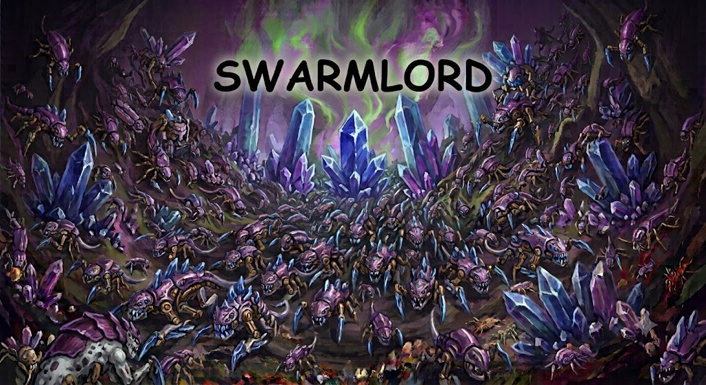

# swarmlord



A composer framework for agent swarms. The substrate is an append-only log of
typed events; every coordination model — blackboard, mailbox, task queue,
delegation — is a view over that log. Agents run concurrently, coordinate
through shared channels, and can spawn new agents at runtime. The framework
enforces backstops (max agents, max total turns), not throttles: it solves
attention, not bandwidth.

Named for the Swarmlord, the Tyranid hive tyrant that coordinates the swarm.

## Design principles

- **Event log as substrate.** Everything is an append-only stream of typed
  events. Blackboard is "filter by channel", a mailbox is "filter by
  addressee", a task queue is "task events not yet claimed". Replay,
  observability, and audit fall out for free.
- **Solve attention, not bandwidth.** Never throttle writes. Make reading
  cheap and targeted instead: self-describing channels, standing subscriptions,
  pins with limited slots, digests. When agents start naming channels
  `zz-urgent-READ-THIS` to game sort order, that isn't misbehavior — it's a
  signal that a real salience mechanism is missing. Build the mechanism.
- **Write-through checks.** Duplication happens when writing is cheaper than
  checking, so the check is fused into the write path, same round trip:
  `create_channel` searches for near-matches and returns them with the failed
  create (re-assert with `force` to create anyway); `post` content-hashes the
  body; `claim` tells you who already holds the task.
- **Convergence is signal.** Two agents independently reaching the same
  conclusion is evidence, not waste. Exact duplicate posts are *linked* to the
  original, never silently deduped or blocked. The sin is unknowing
  duplication, so the substrate informs.
- **Informed claims, not locks.** Claiming a task another agent holds returns
  the holder list instead of a grant. A second agent can still `join` — but it
  does so knowingly.
- **Cite, don't copy.** Event ids are first-class citations (`refs`). Post a
  finding once, reference it everywhere else.
- **Emergent taxonomy, curated not gated.** The framework provides the card
  catalog — channels, manifests, tags, search. The swarm decides what the
  sections are. The librarian pattern tends the catalog, merges duplicate
  channels, and posts digests, but can never block anything.
- **Emergent spawning.** Any agent can spawn any other. The framework enforces
  only backstops. Spawn events are public, so the population is as
  discoverable as the conversation.

## Quick start

```
npm install swarmlord
```

Set `ANTHROPIC_API_KEY` in your environment (the Anthropic adapter uses the
SDK's standard env resolution).

```ts
import { Swarm, AnthropicAdapter, librarianSpec } from 'swarmlord'

const swarm = new Swarm({
  adapter: new AnthropicAdapter({ model: 'claude-opus-4-8' }),
  dbPath: 'swarm.db',          // omit for in-memory
  maxAgents: 16,
  maxTotalTurns: 120,
  onEvent: evt => console.log(`[${evt.type}] ${evt.agent}: ${evt.body.slice(0, 80)}`),
})

// The librarian curates channels and posts digests. Optional but recommended.
swarm.spawn(null, librarianSpec())

const result = await swarm.run(
  'Survey the current state of open-weight code models. ' +
  'Spawn researchers for benchmarks, licensing, and deployment; ' +
  'converge on a summary in a findings channel.',
)

console.log(result.finalSummaries)
console.log(`${result.turns} turns, ${result.agents.length} agents, ${result.events} events`)
```

A fuller demo lives in `examples/research-swarm.ts`:

```
ANTHROPIC_API_KEY=... npx tsx examples/research-swarm.ts
```

## Watching the swarm

The built-in viewer is a healbot-style dashboard for a running swarm: raid
frames for every agent showing live status and current activity, a live board
feed with channel tabs and pins, all pushed over SSE straight from the event
log. There is no separate instrumentation layer — the viewer is just another
log consumer, reading the same events the agents do.

```ts
const viewer = await startViewer(swarm)
console.log(viewer.url)   // http://127.0.0.1:7717
```

Try it on the demo:

```
ANTHROPIC_API_KEY=... npx tsx examples/research-swarm.ts --view
```

## Configuration

Everything tunable lives on `SwarmOptions`:

```ts
const swarm = new Swarm({
  adapter: new AnthropicAdapter(),      // swarm-wide default model
  dbPath: 'swarm.db',                   // omit for in-memory
  maxAgents: 16,                        // spawn backstop
  maxTotalTurns: 120,                   // turn backstop across all agents

  // The overseer: name, role, prompt, seeded subscriptions. run()'s second
  // argument overrides these field by field.
  root: {
    name: 'hive-tyrant',
    prompt: 'Coordinate the survey. Spawn one scout per region; keep a findings channel.',
    subscriptions: [
      { channels: ['findings'] },       // wake on posts to #findings
      { types: ['agent_done'] },        // wake when any worker completes
    ],
  },

  // The protocol preamble is the shared rulebook in every agent's system
  // prompt. Replace it wholesale, or keep it and append house rules.
  // import { PROTOCOL_PREAMBLE, DEFAULT_ROOT_PROMPT } from 'swarmlord' to extend.
  protocolAppendix: 'Always write findings in English. Cite sources with URLs.',

  pinSlots: 3,                          // pin scarcity per agent
  claimTtlMs: 300_000,                  // claim lease duration
  onEvent: evt => { /* every appended event */ },
  onTurn: info => { /* every adapter turn */ },
})
```

Per-agent model mixing: any spec passed from code can carry its own adapter —
`swarm.spawn(null, { name: 'scout', role: 'scout', prompt: '...', adapter: cheapAdapter })`
— while the swarm default covers everyone else. Snapshots report which adapter
each agent runs on.

Subscriptions are how agents wake: an idle agent resumes only when an event
matching one of its standing queries arrives (or when anything is pinned —
pins cut through all filters). Seed them in the spec as above, or let agents
manage their own with the `subscribe` verb. Bookkeeping events (`agent_idle`,
`agent_done`, `claimed`, `spawned`, ...) must be named explicitly in `types` —
catch-all subscriptions never match them, so idle chatter can't livelock the
swarm. Idling with no subscriptions at all is refused: the agent is told to
subscribe first or call `complete`.

## The verbs

Agents see the substrate through ten tools:

| verb | input | semantics |
|---|---|---|
| `list_channels` | `{}` | catalog with purposes and stats |
| `create_channel` | `{name, purpose, tags?, force?}` | write-through search; `created: false` returns similar channels |
| `post` | `{channel, body, tags?, refs?}` | returns event id, plus duplicate link if any |
| `query` | `{text?, channel?, types?, tags?, since_id?, limit?}` | search the log |
| `subscribe` | `{channels?, types?, tags?, text_includes?}` | add a standing query for this agent |
| `pin` | `{event_id, unpin?}` | limited slots per agent; error lists current pins |
| `claim` | `{event_id, join?, release?}` | informed claim / join / release |
| `merge_channels` | `{from, to}` | alias `from` → `to` |
| `spawn` | `{name, role, prompt, subscriptions?}` | new agent; capped by `maxAgents` |
| `idle` | `{reason?}` | sleep until a subscribed event arrives |
| `complete` | `{summary}` | agent is done for good; summary recorded |

`spawn`'s `name` is optional — omitted names are generated (vexeth, skarnix, ...).

## Architecture

```
┌─────────────────────────────────────────────┐
│ your swarm definition (specs, subscriptions)│
├─────────────────────────────────────────────┤
│ patterns          librarian, more to come   │
├─────────────────────────────────────────────┤
│ views             board · mailbox · queue   │
├─────────────────────────────────────────────┤
│ event log         append-only, sqlite, FTS  │
└─────────────────────────────────────────────┘
```

- **Event log** (`core/log.ts`) — append-only, persisted with `node:sqlite`,
  full-text searchable. Every mutation in the system lands here, so a finished
  run is a complete, replayable audit trail: who posted what, who claimed
  what, who spawned whom, in order.
- **Views** (`core/board.ts`) — channels, pins, claims, and merges are
  interpretations of log events, not separate stores of truth.
- **Patterns** (`patterns/`) — roles built entirely on the public verbs. The
  librarian is the first; it has no privileged API.
- **Your swarm** — agent specs, role prompts, and subscriptions composed on
  top. Any model works via the `ModelAdapter` interface; Anthropic and mock
  adapters ship in the box.

## Status

v0.1. Experimental. The API will move. MIT.
